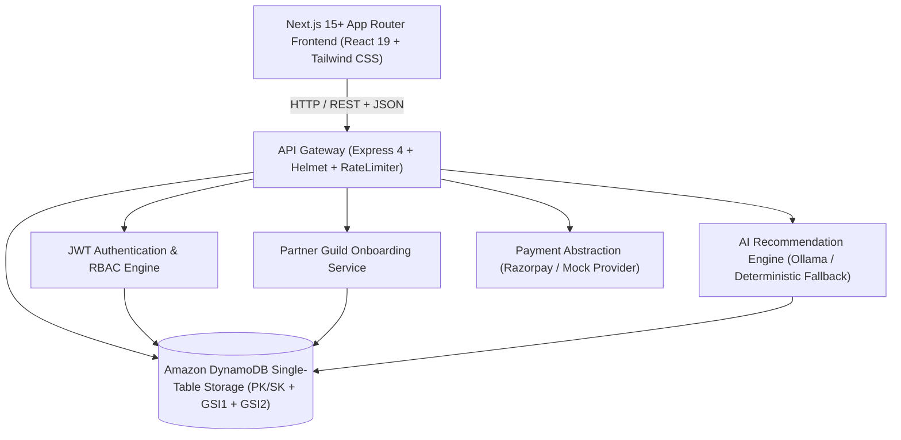

# 🍽️ Food Tailor — Bespoke Culinary Atelier Platform

> **Production-Grade Multi-Brand Culinary Commissioning Platform & Intelligent Degustation Engine**  
> Connecting discerning event hosts with premier heritage culinary brands and artisanal kitchens across Hyderabad.

---

## 🏛️ Executive Summary

**Food Tailor** transforms high-stakes event catering from chaotic, fragmented multi-vendor coordination into an integrated, bespoke culinary atelier. Rather than forcing clients to settle for single-caterer compromises or juggle disparate food delivery orders, Food Tailor empowers hosts to synthesize multi-course feasts composed of iconic signature dishes from celebrated culinary institutions (e.g., *Cafe Niloufer*, *Hotel Shadab*, *Sammosa Singh*, *The Chocolate Room*, *Maharaja Chaat*, *Manam Chocolate*, *Karachi Bakery*, *Almond House*, *Dimmy Pan Palace*, *Ice Berg*, *Thick Shake Factory*) under a single coordinated commission with synchronized logistics, quality audits, and transparent per-head investment.

---

## 🚀 Key Platform Capabilities

- **Bespoke Multi-Course Composition**: 5-chapter intelligent intake gathering occasion dynamics, guest count, dietary spectrum, spice calibration, strict allergen exclusions, and target budget.
- **Dual-Engine AI Recommendation**:
  - *Gemini AI Engine*: Semantic, occasion-attuned degustation synthesis.
  - *Rule-Based Heuristic Engine*: Deterministic fallback guaranteeing 100% operational uptime and budget adherence.
- **Multi-Brand Culinary Synchronization**: Automatically aggregates courses from multiple approved ateliers with full per-kitchen item attribution.
- **Strict Role-Based Access Control (RBAC)**: Enforces complete role isolation (`CUSTOMER`, `PARTNER`, `ADMIN`) and cross-partner multi-tenant isolation.
- **Transparent Commercial Modeling**: Exact numerical synchronization between client review and server-side pricing, breaking down courses subtotal, 10% atelier coordination and quality audit fee, and total due.
- **Payment Abstraction Layer**: Pluggable payment gateway supporting mock development providers and production Razorpay verification with idempotency protection.
- **Telemetry & Observability**: Automated `X-Request-ID` distributed tracing, standardized `{ success, error: { code, message } }` envelopes, and structured logging.

---

## 🏗️ System Architecture



---

## 📦 Workspace Organization

```
stitch_food_tailor_brand_platform/
├── package.json              # Root workspace coordinator (unified dev, test, build, lint scripts)
├── .env.example              # Root environment template (Amazon DynamoDB configuration)
├── .gitignore                # Root gitignore protecting secrets, dependencies, and build outputs
├── README.md                 # Master repository guide
├── docs/                     # Comprehensive architectural & operational documentation
│   ├── architecture.md       # High-level architecture & design patterns
│   ├── api.md                # REST API endpoints, schemas, and error contracts
│   ├── database.md           # Amazon DynamoDB Single-Table schema, GSIs & access patterns
│   ├── security.md           # RBAC policies, partner isolation, rate limiting & secrets
│   ├── testing.md            # Automated testing strategy, unit, security & integration
│   ├── deployment.md         # Production deployment, Docker, AWS DynamoDB guidelines
│   ├── product-flow.md       # End-to-end customer, partner & admin user journeys
│   ├── production-readiness.md # Production readiness audit & scoring checklist
│   └── final-production-readiness.md # Master production readiness certification
├── app/                      # Frontend Application (Next.js 15+, React 19, TypeScript, Tailwind CSS)
│   ├── src/
│   │   ├── app/              # Next.js App Router (Public, Auth, Customer, Partner, Admin portals)
│   │   ├── components/       # Shared UI components, layout, navigation, feedback
│   │   ├── features/         # Domain feature modules (auth, partner onboarding, partner kitchen, admin console)
│   │   ├── views/            # Screen views (Home, Brands, MenuBuilder, Review, Orders)
│   │   └── lib/              # API client, App Router navigation bridge, and utilities
│   ├── package.json
│   ├── next.config.js
│   ├── tsconfig.json
│   └── tailwind.config.js
└── server/                   # Server Application (Node.js, Express, AWS SDK DynamoDB)
    ├── src/
    │   ├── config/           # DynamoDB client, initTables, seedDynamo, env constants
    │   ├── repositories/     # DynamoDB repositories (User, Partner, Dish, Order, Onboarding, Metadata, AI)
    │   ├── middleware/       # Auth, RBAC, RateLimiter, Validation, ErrorHandler
    │   ├── routes/           # REST endpoints (auth, catalog, orders, ai, onboarding, partner, admin)
    │   ├── services/         # Domain services (order lifecycle, AI, payment, catalog, onboarding)
    │   └── utils/            # JWT helpers, password hashing, ID generators
    ├── tests/                # Automated Test Suite (Node.js built-in test runner, 45/45 passing)
    │   ├── unit/             # Auth utilities, DynamoDB DAL, Onboarding & Order state machine tests
    │   ├── security/         # RBAC role enforcement & cross-partner isolation tests
    │   └── integration/      # Health check, catalog & full commission lifecycle tests
    ├── e2e-test.js           # Full 12-step end-to-end platform verification runner
    └── package.json
```

---

## ⚡ Quickstart & Local Setup

### 1. Prerequisites
- **Node.js**: v20.x or v22.x LTS (compatible with v24)
- **Amazon DynamoDB**: Local DynamoDB instance on port `8000` or AWS DynamoDB managed service

### 2. Environment Configuration
Copy `.env.example` to `server/.env` and update values if needed:
```bash
cp .env.example server/.env
```

### 3. Install Dependencies
```bash
npm install --prefix server
npm install --prefix app
```

### 4. Database Setup & Seeding
```bash
npm run db:init
npm run db:seed
```

### 5. Launch Development Servers
Run both frontend and backend concurrently:
```bash
# Terminal 1: Backend Server (runs on http://localhost:3001)
npm run dev:server

# Terminal 2: Frontend Client (Next.js runs on http://localhost:3000)
npm run dev:app
```

---

## 🧪 Testing & Verification Suite

The repository includes a comprehensive, multi-layer automated test suite using Node.js's native test runner (`node:test`) and zero third-party testing dependencies:

| Test Command | Scope | Target |
| :--- | :--- | :--- |
| `npm test` | Unit, Security & Integration Tests | Runs all 45 automated test cases in `server/tests/` (100% pass) |
| `npm run test:e2e` | End-to-End Workflow Verification | Executes 12-step complete commission & onboarding lifecycle in `server/e2e-test.js` |
| `npm run lint` | Frontend Code Quality | Executes `oxlint` static code analysis across client components (0 errors, 0 warnings) |
| `npm run build` | Production Bundle | Verifies clean client production compilation |

---

## 👥 Seed Accounts & Access Credentials

The database seed provides ready-to-test credentials for all platform roles:

| Role | Email | Password | Access Capabilities |
| :--- | :--- | :--- | :--- |
| **Administrator** | `admin@foodtailor.in` | `password123` | Full executive console (`/admin`), global order control, partner approvals, AI telemetry |
| **Partner (Cafe Niloufer)** | `partner1@foodtailor.in` | `password123` | Partner kitchen portal (`/partner`), accept/reject orders containing Niloufer items |
| **Partner (Hotel Shadab)** | `partner2@foodtailor.in` | `password123` | Partner kitchen portal (`/partner`), accept/reject orders containing Shadab items |
| **Customer (Host)** | `test@foodtailor.in` | `password123` | Customer degustation dashboard (`/dashboard`), bespoke menu builder, order tracking |

---

## 📖 In-Depth Documentation

For complete technical specifications, refer to the documentation suite in `docs/`:
- [Architecture & Design Decisions](docs/architecture.md)
- [API Reference & Error Contract](docs/api.md)
- [Database Schema & Migration Guide](docs/database.md)
- [Security & RBAC Enforcement](docs/security.md)
- [Testing Architecture & QA Verification](docs/testing.md)
- [Production Deployment & DevOps Runbook](docs/deployment.md)
- [End-to-End Product Flow](docs/product-flow.md)
- [Production Readiness Audit & Scoring](docs/production-readiness.md)
- [Executive Engineering Audit Report](docs/final-audit-report.md)
