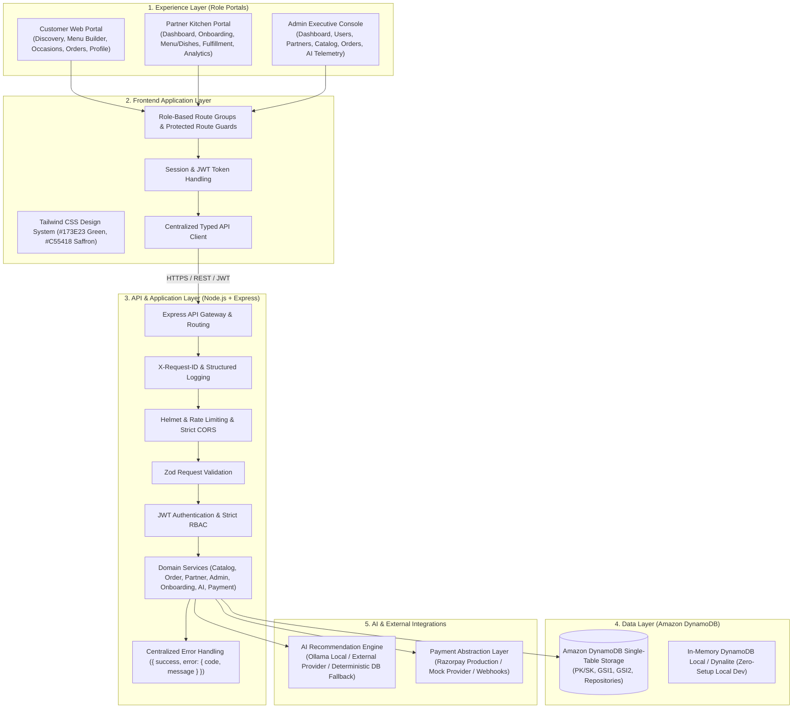
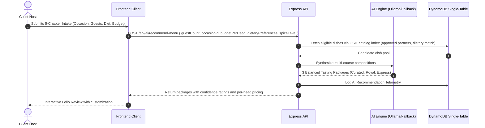
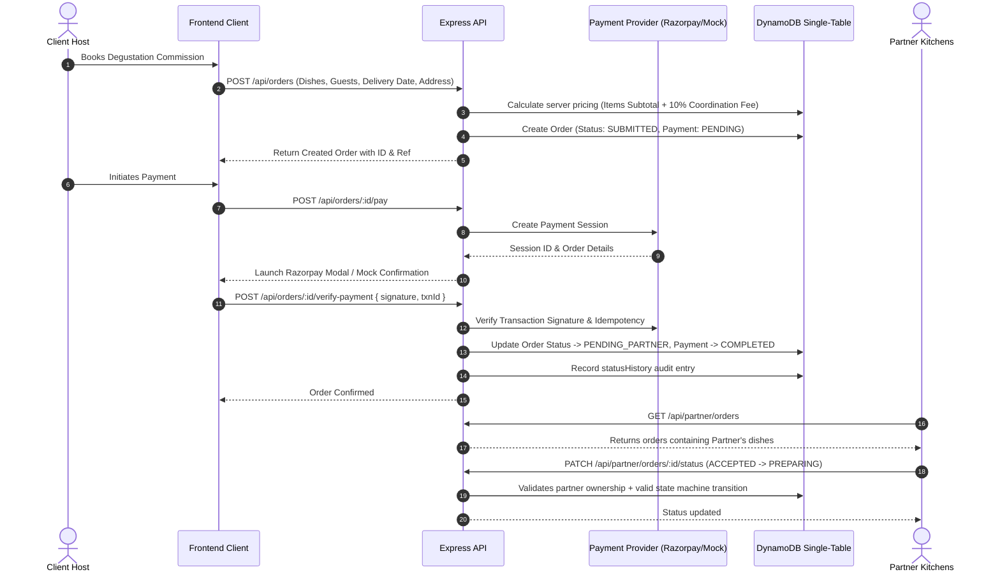
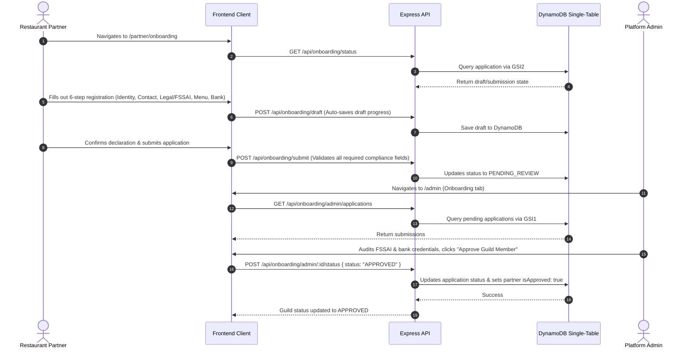

# 🏛️ Architecture & System Design Specification

## 1. Architectural Principles

Food Tailor is architected as a **modular full-stack application** aligned directly with the **Food Tailor — Full Product Architecture**:
- **Experience Layer**: Dedicated role portals for `CUSTOMER`, `PARTNER` (with mandatory onboarding verification), and `ADMIN` (executive console).
- **Frontend Application Layer**: Modern web application built with Next.js 15+ App Router, React 19, TypeScript, Tailwind CSS, desktop-first responsive design, and centralized typed API client.
- **API & Application Layer**: Node.js + Express REST API with JWT authentication, RBAC authorization, request validation, rate limiting, CORS, security headers, request ID tracking, and standardized error envelopes.
- **Data Layer**: Amazon DynamoDB Single-Table architecture as the authoritative primary database with zero runtime dependency on PostgreSQL or Prisma.
- **AI & Integration Layer**: AI Recommendation Engine with local Ollama support, external provider configurability, and deterministic DynamoDB fallback.
- **Payment Layer**: Pluggable payment abstraction supporting Razorpay in production and Mock provider for testing, with webhook verification, server-side pricing calculations, and idempotency.

---

## 2. Target Component Diagram

---

## 3. Data Flow Workflows

### 3.1 Bespoke Menu Synthesis

### 3.2 Commission Booking & Multi-Brand Fulfillment

### 3.3 Partner Guild Onboarding & Admin Audit

---

## 4. Observability & Security

- **Request ID Tracking**: Generated via `crypto.randomUUID()` in `server/src/index.js`. Stamped on incoming requests and returned in `X-Request-ID` response headers.
- **Structured Error Responses**: All API errors are normalized into `{ success: false, error: { code: string, message: string, details?: any[] } }`.
- **RBAC & Ownership Security**: Strict role checks (`CUSTOMER`, `PARTNER`, `ADMIN`) and cross-tenant item validation preventing IDOR vulnerabilities.
- **DynamoDB Audit Trail**: Append-only status transitions and operational logging.
