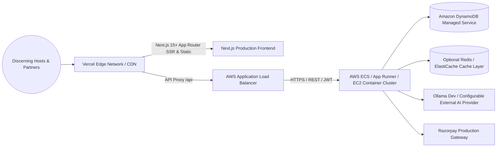

# 🚀 Production Deployment & DevOps Runbook

## 1. Production Architecture Overview

In production, Food Tailor operates across modern cloud infrastructure matching the **Food Tailor — Full Product Architecture**:



---

## 2. Environment Configuration

### Required Production Environment Variables (`server/.env`):
```ini
NODE_ENV=production
PORT=3001

# Amazon DynamoDB Configuration
AWS_REGION=ap-south-1
DYNAMODB_TABLE_NAME=food_tailor_production
# In AWS ECS/EKS/EC2, use IAM Roles instead of hardcoded credentials
# AWS_ACCESS_KEY_ID=
# AWS_SECRET_ACCESS_KEY=

# Optional Redis / ElastiCache Cache Layer
# REDIS_URL=redis://elasticache-cluster.foodtailor.cache.amazonaws.com:6379

# JWT Secrets (Generate with `openssl rand -hex 64`)
JWT_ACCESS_SECRET=secure_production_access_secret_hex_string_64_chars
JWT_REFRESH_SECRET=secure_production_refresh_secret_hex_string_64_chars
JWT_ACCESS_EXPIRY=15m
JWT_REFRESH_EXPIRY=7d

# CORS Origin (Strict production origin)
CORS_ORIGIN=https://foodtailor.in

# Payment Gateway (Production Razorpay)
PAYMENT_PROVIDER=razorpay
RAZORPAY_KEY_ID=rzp_live_xxxxxxxxxxxx
RAZORPAY_KEY_SECRET=your_live_razorpay_secret
RAZORPAY_WEBHOOK_SECRET=your_live_webhook_secret

# AI Recommendation Engine
AI_PROVIDER=external
AI_PROVIDER_URL=https://api.external-ai.com/v1
AI_API_KEY=your_production_ai_key
```

### Required Frontend Environment Variables (`app/.env.production`):
```ini
NEXT_PUBLIC_API_URL=https://api.foodtailor.in
```

---

## 3. Production Build & Deployment Commands

### 3.1 Frontend Build (Next.js 15+ App Router)
```bash
# Build production Next.js application
npm run build
# Ready for zero-config Vercel deployment or standalone Docker container
npm run start
```

### 3.2 Database Initialization in Production
```bash
# Initialize DynamoDB tables and GSIs on AWS
npm --prefix server run db:init
# Optionally seed foundational categories, cuisines, and occasions
npm --prefix server run db:seed
```

### 3.3 Backend Docker Containerization
```dockerfile
# Multi-stage Dockerfile for Backend
FROM node:22-alpine AS builder
WORKDIR /app
COPY server/package*.json ./
RUN npm ci --only=production
COPY server/src ./src

FROM node:22-alpine AS runner
WORKDIR /app
ENV NODE_ENV=production
ENV PORT=3001
COPY --from=builder /app ./
USER node
EXPOSE 3001
CMD ["node", "src/index.js"]
```

---

## 4. Health Checks & Observability

- **API Liveness / Readiness**: `GET /api/health`
  - Returns `200 OK` with DynamoDB connection state, server uptime, and `x-request-id` header.
- **Audit Logging**: All order transitions, payment captures, partner onboarding submissions, and admin actions append structured audit logs directly to DynamoDB.
