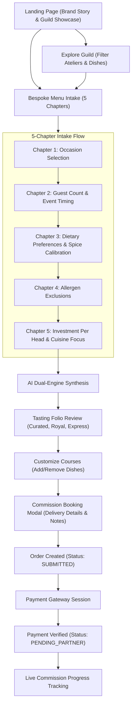
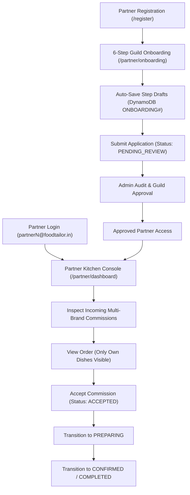
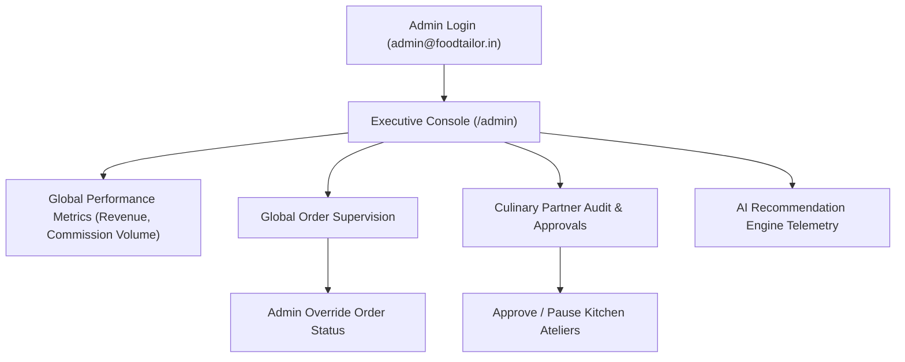

# 🧭 End-to-End Product Flow & User Journeys

This document details the three core user workflows across the Food Tailor platform:
1. **Client / Event Host Journey**
2. **Partner Kitchen / Brand Journey**
3. **Administrator Executive Journey**

---

## 1. Client / Event Host Journey

---

## 2. Partner Kitchen / Brand Journey

---

## 3. Administrator Executive Journey

